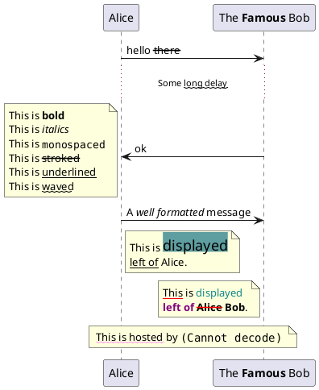

# Sample Markdown

This is a sample markdown file to test the plugin `remark-local-plantuml`.

If the code blocks like following are contained, it should be converted to an inline svg.

## A Simple Code Block

<div class="plantuml-diagram"><svg xmlns="http://www.w3.org/2000/svg" xmlns:xlink="http://www.w3.org/1999/xlink" contentStyleType="text/css" height="465px" preserveAspectRatio="none" style="width:391px;height:465px;background:#FFFFFF;" version="1.1" viewBox="0 0 391 465" width="391px" zoomAndPan="magnify"><defs><filter height="1" id="bv3dnt9fnzvzu0" width="1" x="0" y="0"><feFlood flood-color="#5F9EA0" result="flood"/><feComposite in="SourceGraphic" in2="flood" operator="over"/></filter></defs><g><line style="stroke:#181818;stroke-width:0.5;stroke-dasharray:5.0,5.0;" x1="150" x2="150" y1="37.6094" y2="77.9609"/><line style="stroke:#A80036;stroke-width:1.0;stroke-dasharray:1.0,4.0;" x1="150" x2="150" y1="77.9609" y2="119.7969"/><line style="stroke:#181818;stroke-width:0.5;stroke-dasharray:5.0,5.0;" x1="150" x2="150" y1="119.7969" y2="428.8545"/><line style="stroke:#181818;stroke-width:0.5;stroke-dasharray:5.0,5.0;" x1="323.4912" x2="323.4912" y1="37.6094" y2="77.9609"/><line style="stroke:#A80036;stroke-width:1.0;stroke-dasharray:1.0,4.0;" x1="323.4912" x2="323.4912" y1="77.9609" y2="119.7969"/><line style="stroke:#181818;stroke-width:0.5;stroke-dasharray:5.0,5.0;" x1="323.4912" x2="323.4912" y1="119.7969" y2="428.8545"/><rect fill="#E2E2F0" height="31.6094" rx="2.5" ry="2.5" style="stroke:#181818;stroke-width:0.5;" width="44.3447" x="128" y="5"/><text fill="#000000" font-family="sans-serif" font-size="14" lengthAdjust="spacing" textLength="30.3447" x="135" y="26.5332">Alice</text><rect fill="#E2E2F0" height="31.6094" rx="2.5" ry="2.5" style="stroke:#181818;stroke-width:0.5;" width="44.3447" x="128" y="427.8545"/><text fill="#000000" font-family="sans-serif" font-size="14" lengthAdjust="spacing" textLength="30.3447" x="135" y="449.3877">Alice</text><rect fill="#E2E2F0" height="31.6094" rx="2.5" ry="2.5" style="stroke:#181818;stroke-width:0.5;" width="124.4893" x="261.4912" y="5"/><text fill="#000000" font-family="sans-serif" font-size="14" lengthAdjust="spacing" textLength="24.124" x="268.4912" y="26.5332">The</text><text fill="#000000" font-family="sans-serif" font-size="14" font-weight="bold" lengthAdjust="spacing" textLength="53.6758" x="296.5049" y="26.5332">Famous</text><text fill="#000000" font-family="sans-serif" font-size="14" lengthAdjust="spacing" textLength="24.9102" x="354.0703" y="26.5332">Bob</text><rect fill="#E2E2F0" height="31.6094" rx="2.5" ry="2.5" style="stroke:#181818;stroke-width:0.5;" width="124.4893" x="261.4912" y="427.8545"/><text fill="#000000" font-family="sans-serif" font-size="14" lengthAdjust="spacing" textLength="24.124" x="268.4912" y="449.3877">The</text><text fill="#000000" font-family="sans-serif" font-size="14" font-weight="bold" lengthAdjust="spacing" textLength="53.6758" x="296.5049" y="449.3877">Famous</text><text fill="#000000" font-family="sans-serif" font-size="14" lengthAdjust="spacing" textLength="24.9102" x="354.0703" y="449.3877">Bob</text><polygon fill="#181818" points="311.7358,65.9609,321.7358,69.9609,311.7358,73.9609,315.7358,69.9609" style="stroke:#181818;stroke-width:1.0;"/><line style="stroke:#181818;stroke-width:1.0;" x1="150.1724" x2="317.7358" y1="69.9609" y2="69.9609"/><text fill="#000000" font-family="sans-serif" font-size="13" lengthAdjust="spacing" textLength="27.4663" x="157.1724" y="65.1045">hello</text><text fill="#000000" font-family="sans-serif" font-size="13" lengthAdjust="spacing" text-decoration="line-through" textLength="29.6309" x="188.2505" y="65.1045">there</text><text fill="#000000" font-family="sans-serif" font-size="11" lengthAdjust="spacing" textLength="28.7354" x="195.9834" y="103.3799">Some</text><text fill="#000000" font-family="sans-serif" font-size="11" lengthAdjust="spacing" text-decoration="wavy underline" textLength="50.1499" x="227.7749" y="103.3799">long delay</text><text fill="#000000" font-family="sans-serif" font-size="11" lengthAdjust="spacing" textLength="3.0562" x="277.9248" y="103.3799">&#160;</text><polygon fill="#181818" points="161.1724,182.3384,151.1724,186.3384,161.1724,190.3384,157.1724,186.3384" style="stroke:#181818;stroke-width:1.0;"/><line style="stroke:#181818;stroke-width:1.0;" x1="155.1724" x2="322.7358" y1="186.3384" y2="186.3384"/><text fill="#000000" font-family="sans-serif" font-size="13" lengthAdjust="spacing" textLength="13.73" x="167.1724" y="181.4819">ok</text><path d="M5,124.7969 L5,232.7969 L145,232.7969 L145,134.7969 L135,124.7969 L5,124.7969 " fill="#FEFFDD" style="stroke:#181818;stroke-width:0.5;"/><path d="M135,124.7969 L135,134.7969 L145,134.7969 L135,124.7969 " fill="#FEFFDD" style="stroke:#181818;stroke-width:0.5;"/><text fill="#000000" font-family="sans-serif" font-size="13" lengthAdjust="spacing" textLength="37.5591" x="11" y="143.292">This is</text><text fill="#000000" font-family="sans-serif" font-size="13" font-weight="bold" lengthAdjust="spacing" textLength="27.4346" x="52.1709" y="143.292">bold</text><text fill="#000000" font-family="sans-serif" font-size="13" lengthAdjust="spacing" textLength="37.5591" x="11" y="159.6436">This is</text><text fill="#000000" font-family="sans-serif" font-size="13" font-style="italic" lengthAdjust="spacing" textLength="32.5063" x="52.1709" y="159.6436">italics</text><text fill="#000000" font-family="sans-serif" font-size="13" lengthAdjust="spacing" textLength="37.5591" x="11" y="176.6172">This is</text><text fill="#000000" font-family="monospace" font-size="13" lengthAdjust="spacing" textLength="78.0127" x="52.1709" y="175.5698">monospaced</text><text fill="#000000" font-family="sans-serif" font-size="13" lengthAdjust="spacing" textLength="37.5591" x="11" y="192.9688">This is</text><text fill="#000000" font-family="sans-serif" font-size="13" lengthAdjust="spacing" text-decoration="line-through" textLength="42.6309" x="52.1709" y="192.9688">stroked</text><text fill="#000000" font-family="sans-serif" font-size="13" lengthAdjust="spacing" textLength="37.5591" x="11" y="209.3203">This is</text><text fill="#000000" font-family="sans-serif" font-size="13" lengthAdjust="spacing" text-decoration="underline" textLength="60.7153" x="52.1709" y="209.3203">underlined</text><text fill="#000000" font-family="sans-serif" font-size="13" lengthAdjust="spacing" textLength="37.5591" x="11" y="225.6719">This is</text><text fill="#000000" font-family="sans-serif" font-size="13" lengthAdjust="spacing" text-decoration="wavy underline" textLength="37.5781" x="52.1709" y="225.6719">waved</text><polygon fill="#181818" points="311.7358,256.8799,321.7358,260.8799,311.7358,264.8799,315.7358,260.8799" style="stroke:#181818;stroke-width:1.0;"/><line style="stroke:#181818;stroke-width:1.0;" x1="150.1724" x2="317.7358" y1="260.8799" y2="260.8799"/><text fill="#000000" font-family="sans-serif" font-size="13" lengthAdjust="spacing" textLength="8.6709" x="157.1724" y="256.0234">A</text><text fill="#000000" font-family="sans-serif" font-size="13" font-style="italic" lengthAdjust="spacing" textLength="80.9199" x="169.4551" y="256.0234">well formatted</text><text fill="#000000" font-family="sans-serif" font-size="13" lengthAdjust="spacing" textLength="52.749" x="253.9868" y="256.0234">message</text><path d="M155,273.8799 L155,321.8799 L293,321.8799 L293,283.8799 L283,273.8799 L155,273.8799 " fill="#FEFFDD" style="stroke:#181818;stroke-width:0.5;"/><path d="M283,273.8799 L283,283.8799 L293,283.8799 L283,273.8799 " fill="#FEFFDD" style="stroke:#181818;stroke-width:0.5;"/><text fill="#000000" font-family="sans-serif" font-size="13" lengthAdjust="spacing" textLength="37.5591" x="161" y="298.6641">This is</text><text fill="#000000" filter="url(#bv3dnt9fnzvzu0)" font-family="sans-serif" font-size="18" lengthAdjust="spacing" textLength="76.0518" x="202.1709" y="297.5654">displayed</text><text fill="#000000" font-family="sans-serif" font-size="13" lengthAdjust="spacing" text-decoration="underline" textLength="31.7954" x="161" y="315.0156">left of</text><text fill="#000000" font-family="sans-serif" font-size="13" lengthAdjust="spacing" textLength="31.7891" x="196.4072" y="315.0156">Alice.</text><path d="M195,332.8721 L195,374.8721 L318,374.8721 L318,342.8721 L308,332.8721 L195,332.8721 " fill="#FEFFDD" style="stroke:#181818;stroke-width:0.5;"/><path d="M308,332.8721 L308,342.8721 L318,342.8721 L308,332.8721 " fill="#FEFFDD" style="stroke:#181818;stroke-width:0.5;"/><text fill="#000000" font-family="sans-serif" font-size="13" lengthAdjust="spacing" text-decoration="underline" textLength="24.5591" x="201" y="351.3672">This</text><text fill="#000000" font-family="sans-serif" font-size="13" lengthAdjust="spacing" textLength="9.3882" x="229.1709" y="351.3672">is</text><text fill="#118888" font-family="sans-serif" font-size="13" lengthAdjust="spacing" textLength="54.9263" x="242.1709" y="351.3672">displayed</text><text fill="#800080" font-family="sans-serif" font-size="13" font-weight="bold" lengthAdjust="spacing" textLength="35.3818" x="201" y="367.7188">left of</text><text fill="#000000" font-family="sans-serif" font-size="13" font-weight="bold" lengthAdjust="spacing" textLength="3.6118" x="236.3818" y="367.7188">&#160;</text><text fill="#000000" font-family="sans-serif" font-size="13" font-weight="bold" lengthAdjust="spacing" text-decoration="line-through" textLength="31.0718" x="239.9937" y="367.7188">Alice</text><text fill="#000000" font-family="sans-serif" font-size="13" font-weight="bold" lengthAdjust="spacing" textLength="25.27" x="274.6772" y="367.7188">Bob</text><text fill="#000000" font-family="sans-serif" font-size="13" lengthAdjust="spacing" textLength="3.6118" x="299.9473" y="367.7188">.</text><path d="M110,385.5752 L110,413.5752 L362,413.5752 L362,395.5752 L352,385.5752 L110,385.5752 " fill="#FEFFDD" style="stroke:#181818;stroke-width:0.5;"/><path d="M352,385.5752 L352,395.5752 L362,395.5752 L352,385.5752 " fill="#FEFFDD" style="stroke:#181818;stroke-width:0.5;"/><text fill="#000000" font-family="sans-serif" font-size="13" lengthAdjust="spacing" text-decoration="wavy underline" textLength="80.2026" x="118.4019" y="405.998">This is hosted</text><text fill="#000000" font-family="sans-serif" font-size="13" lengthAdjust="spacing" textLength="13.73" x="202.2163" y="405.998">by</text><text fill="#000000" font-family="monospace" font-size="14" lengthAdjust="spacing" textLength="126.0205" x="219.5581" y="404.6504">(Cannot&#160;decode)</text><!--SRC=[PL71QeGm4BtdAmPx2zMmz5940jk3Fz3U9PfPJJSwaiGkxS5lR-9kjz9AGF9cvhqtBxDomNHcLbE0epKTidc7P6y30kUr6cdndCCBjHaed_wCRUsGotI34WQqbY3Fmu0EyvmLHG6lD2AigwMf1urMVQuhH9obYJXuPIY1pcoYW63n51Z0ss0ynCDvIrPpleE4C475AI_43isoaIRoi-fGPzckaES-E3gZZdv-qQPP9etEcWbrq-mAwtfH7wZNbU6a8Ldwj-KnMhZ4JU54RbGXe1O2HlHUzNXTmfb-242dMvntygfLtRdibCRGsWLbvSqNbeTdgOsVOpIeAv4WMOdKALdqcGA9L4rp9Ij-VTtpIahfEQ1QIeTQ9hbAB7AJxCYIWuV3uJb-Uw6j42Kul_NCYvijoXlZJmDKVYFTrAEzuCmPjoWu_sk6Fj1TRJxU35tAXxf-Ugfh-PF1G3ua-Ok4zXCgC_RWQN4TnZHxBDxdNjvPlm40]--></g></svg></div>

<details>
  <summary>View source</summary>



</details>

## A Different Code Block

```javascript
console.log("This code block should be ignored");
```
